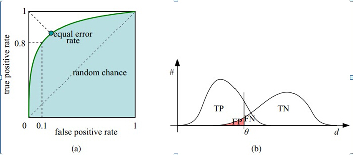

# 分类器性能指标：ROC曲线和AUC值

## 1. ROC 曲线

### a. 定义

​	接收者特征（receiver operating characteristic），ROC 曲线上每个点反映着对同一信号刺激的感受性。

**横轴**：负正类率（false positive rate：FPR）特异度，划分实例中所有负例占所有负例的比例；（1 - Specificity）

**纵轴**：真正类率（true positive rare：TPR）灵敏度，Sensitivity（正类覆盖率）

### b. ROC 计算前的准备

​	针对一个二分类问题，将实例分成正类（positive）或者负类（negative）。但是实际中分类时，会出现四种情况：

（1）、若一个实例是正类并且被预测为正类，即为真正类（True Positive：TP）：正确的肯定数目

（2）、若一个实例是正类，但是被预测成为负类，即为假负类（False Negative：FN）：漏报，没有找到正确匹配的数目

（3）、若一个实例是负类，但是被预测为正类，即为假正类（False Positive：FP）：误报，没有匹配不正确的数目

（4）、若一个实例是负类并且被预测为负类，即为真负类（True Negative：TN）：正确拒绝的非匹配数目

列联表如下：1 代表正类，0 代表负类：

<table  border="1" cellpadding="10">
		  <tr>
		    <th></th>
		    <th></th>
		    <th colspan="2">预测</th>
		    <th></th>
		  </tr>
		  <tr>
		    <td></td>
		    <td></td>
		     <td>1</td>
		    <td>0</td>
		    <td>合计</td>
		  </tr>
		  <tr>
		    <td rowspan="2">实际</td>
		    <td>1</td>
		    <td>True Postive TP</td>
		    <td>Frue Negative FM</td>
		    <td>Actual Postive(TP+FN)</td>
		  </tr>
		  <tr>
		    <td>0</td>
		    <td>False Postive FP</td>
		    <td>True Negative TP</td>
		    <td>Actual Negative(FR+TN)</td>
		  </tr>
		   <tr>
		   	<td>合计</td>
		    <td></td>
		    <td>Predicted Postive(TP+FP)</td>
		    <td>Predicted Negative(FN+TN)</td>
		    <td>TP+FN+FP+TN</td>
		  </tr>
		</table>

由上表可得出横、纵轴的计算公式：

1. 真正类率（True Positive Rate）TPR：TP / (TP + FN)，代表分类器预测的正类中实际正实例占所有正实例的比例。Sensitivity
2. 负正类率（False Positive Rate）FPR：FP / (FP + TN)，代表分类器预测的正类中实际负实例占所有负实例的比例。1 - Specificity
3. 真负类率（True Negative Rate）TNR：TN / (FP + TN)，代表分类器预测的负类中实际负实例占所有负实例的比例，TNR = 1 - FPR. Specificity

​	假设采用逻辑斯蒂回归分类器，其给出针对每个实例为正类的概率，那么通过设定一个阈值如0.6，概率大于等于0.6的为正类，小于0.6的为负类。对应的就可以算出一组（FPR，TPR），在平面中得到对应坐标点。随着阈值的逐渐减少，越来越多的实例被划分为正类，但是这些正类中同样也掺杂着真正的负实例，即TPR和FPR会同时增大。阈值最大时，对应坐标点（0,0），阈值最小时，对应坐标点（1,1）。

​	如下图 a 图中实线为 ROC 曲线，线上每个点对应一个阈值：

横轴FPR：1 - TNR，1 - Specificity，FPR 越大，预测正类中实际负类越多。

纵轴TPR：Sensitivity（正类覆盖率），TPR 越大，预测正类中实际正类越多。

​	理想目标：TPR = 1，FPR = 0，即图中（0, 1）点，故 ROC 曲线越靠拢（0, 1），越偏离 45 度对角线越好，Sensitivity、Specificity 越大效果越好。

### c. 如何画 ROC 曲线

​	假设已经得出一系列样本被划分为正类的概率，然后按照大小排序，下图是一个示例，图中共有20个测试样本，“class”一栏表示每个测试样本真正的标签（p表正样本，n表示负样本），“score”表示每个测试样本属于正样本的概率。

​	接下来，我们从高到低，依次将“Score”值作为阈值threshold，当测试样本属于正样本的概率大于或等于这个threshold时，我们认为它为正样本，否则为负样本。举例来说，对于图中的第4个样本，其“Score”值为0.6，那么样本1，2，3，4都被认为是正样本，因为它们的“Score”值都大于等于0.6，而其他样本则都认为是负样本。每次选取一个不同的threshold，我们就可以得到一组FPR和TPR，即ROC曲线上的一点。这样一来，我们一共得到了20组FPR和TPR的值，将它们画在ROC曲线的结果如下图：

​	AUC(Area under Curve)：Roc曲线下的面积，介于0.1和1之间。Auc作为数值可以直观的评价分类器的好坏，值越大越好。

## 2. AUC 值

### a. 定义

​	**首先AUC值是一个概率值，当你随机挑选一个正样本以及负样本，当前的分类算法根据计算得到的Score值将这个正样本排在负样本前面的概率就是AUC值，AUC值越大，当前分类算法越有可能将正样本排在负样本前面，从而能够更好地分类。**

定义：**一个正例，一个负例，预测为正的概率值比预测为负的概率值还要大的可能性**

### b. 计算方式

根据定义，最直观的有两种计算 AUC 的方法：

1. 绘制 ROC 曲线，ROC 曲线下面的面积就是 AUC 的值；
2. 假设总共有（m + n）个样本，其中正样本 m 个，负样本 n 个，总有 m * n 个样本对，计数，正样本预测为正样本的概率值大于负样本预测为正样本的概率值记为 1，累加计数，然后除以（m * n）就是 AUC 的值；
3. 第三种方法实际上和上述第二种方法是一样，但是复杂度减小了。它也是首先对 score 从大到小排序，然后令最大 score 对应的 sample 的 rank 为 n，第二大 score 对应 sample 的 rank 为 n-1， 以此类推。然后把所有的正类样本的 rank 相加，再减去 m-1 种两个正样本组合的情况。得到的就是所有的样本中有多少对正类样本的 score 大于负类样本的 score。然后再除以 m * n。

​	公式解释：

​		a. 为了求得组合中正样本的 score 值大于负样本，如果所有的正样本 score 值都是大于负样本的，那么第一位与任意的进行组合 score 值都要大，我们取它的 rank 值为 n，但是 n-1 中有 m-1 是正样本和正样本的组合这种是不在统计范围内的（为计算方便我们取 n 值，相应不符合的有 m 个），所以要减掉，那么同理排在第二位的 n-1，会有 m-1 个是不满足的，依次类推，故得到后面的公式 m（m+1) / 2，我们可以验证在正样本 score 都大于负样本的假设下， AUC 的值为1；

​		b. 根据上面的解释，不难得出，rank 的值代表的是能够产生 score 前大后小的这样的组合数，但是这里包含了（正，正）的情况，所以要减去这样的组（即排在它后面正例的个数），即可得到上面的公式。

​		c. 特别需要注意的是，再存在 score 相等的情况时，对相等 score 的样本，需要赋予相同的 rank （无论这个相等的 score 是出现在同类样本还是不同类样本之间，都需要这样处理）。具体操作就是再把所有这些 score 相等的样本的 rank 取平均。然后再使用上述公式。

## 3. 为什么使用 ROC曲线和AUC值评价分类器

​	既然已经这么多标准，为什么还要使用 ROC 和 AUC 呢？因为 ROC 曲线有个很好的特性：当测试集中的正负样本的分布变换的时候， ROC 曲线能够保持不变。在实际的数据集中经常会出现样本类不平衡，即正负样本比例差距较大，而且测试数据中的正负样本也可能随着时间变化。下图是 ROC 曲线和 Presision-Recall 曲线的对比：

在上图中，(a)和(c)为Roc曲线，(b)和(d)为Precision-Recall曲线。

(a)和(b)展示的是分类其在原始测试集(正负样本分布平衡)的结果，(c)(d)是将测试集中负样本的数量增加到原来的10倍后，分类器的结果，可以明显的看出，ROC曲线基本保持原貌，而Precision-Recall曲线变化较大。