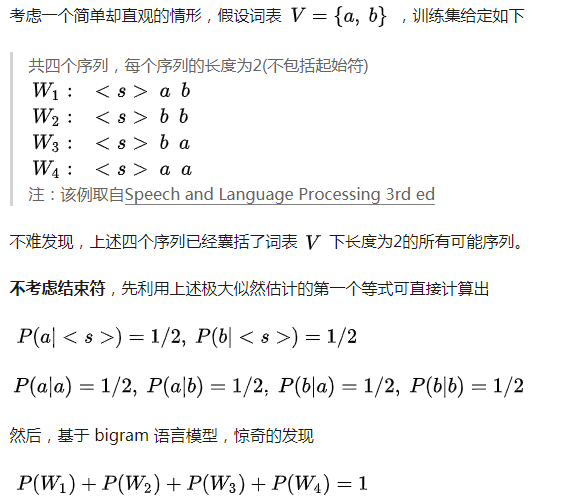

# N-gram 知识梳理

## 1. 语言模型的定义

1. 语言模型就是用来计算一个句子的概率的模型，也就是判断一句话是正确的概率。即对于语言序列 $$ w_1,w_2,\cdots w_n $$ ，语言模型就是计算该序列的概率，即 $$ P(w_1,w_2, \cdots w_n) $$ 
2. 从机器学习的角度来看：语言模型是对语句的概率分布的建模。
3. 通俗解释：语言模型是用来判断一个语句是否是正常语句，即是否是人话，如 P(我爱北京天安门) > P(我爱天安门北京)

## 2. N-gram的定义

1. N-gram （N元语法）是一个统计语言模型，首先对于 $$ P(w_1,w_2, \cdots w_n) $$  计算，可以通过链式法则可以得到下式：

   $$
   P(w_1,w_2,...,w_n)=P(w_1)P(w_2|w_1)\cdot\cdot\cdot P(w_n|w_1,...,w_{n-1})
   $$
   在统计语言模型中，采用极大似然估计来计算每个词出现的条件概率，即

   $$
   P(w_i|w_1,...,w_{i-1})=\frac{C(w_1,w_2,...,w_i)}{\sum_{w}C(w_1,w_2,..w_{i-1},w)}\\ \overset{\text{?}}{=}\frac{C(w_1,w_2,...,w_i)}{C(w_1,w_2,..w_{i-1})}
   $$
   分子：从语料库中查询 $$ w_1,w_2, \cdots w_{i-1} $$ ,  $$ w_i $$  这个序列出现的频次；

   分母：从语料库中查询 $$ w_1,w_2, \cdots w_{i-1} $$ 这个序列出现的频次；

2. 对于任意长的自然语言语句，根据极大似然估计直接计算 $$ P(w_i | w_1, w_2, \cdots  w_{i-1}) $$ 是不现实的。为了解决这个问题，我们引入马尔可夫假设，即假设当前词出现的概率只依赖于前 n-1 个词，可以得到：

   $$
   P(w_i|w_1,w_2,...,w_{i-1})=P(w_i|w_{i-n+1},...,w_{i-1})
   $$
   

3. 其中 N-gram 中的 N 代表的是当前单词与其前面 N-1 个单词相关；如当 N = 2 时，则当前单词只跟它前面一个单词相关；当 N = 3 时，则当前单词跟它前面两个单词相关，则定义 n-gram 语言模型如下：

   当 N = 1 时：

   $$
   P(w_1,w_2,...,w_n)=\prod_{i=1}^{n}P(w_i)
   $$
   当 N = 2 时：

   $$
   P(w_1,w_2,...,w_n)=\prod_{i=1}^{n}P(w_i|w_{i-1})
   $$
   当 N = 3 时：

   $$
   P(w_1,w_2,...,w_n)=\prod_{i=1}^{n}P(w_i|w_{i-2},w_{i-1})
   $$
   ...

   其中，当 n > 1 时，为了使句首词的条件概率有意义，需要给原序列加上一个或多个起始符 <S> 。可以说起始符的作用就是为了**表征句首词出现的条件概率**。

   备注：上述三个公式里面的 $$ p(w_i) $$ 、$$p(w_i | w_{i-1}) $$ 和 $$ p(w_i | w_{i-2},w_{i-1}) $$ 是通过训练语料进行计算得到，然后在生成句子的时候，根据各个字或词的概率进行抽样，得到下一个字或词。

4. 此处说明一下序列结束符</s> 的意义，举例如下：

   

   当列举序列长度为 3 的时候，结论跟上面的一样。而语言模型是建模所有句子的概率分布。但上述结果中当序列长度为2时，其概率已经等于1，则说明长度不等于2的序列不存在？故上述结果与语言模型是建模所有句子的概率分布相矛盾。故得出结论如下：

   - 当不加结束符时，n-gram 语言模型只能分别对所有固定长度的序列进行概率分布建模，而不是任意长度的序列。因为当序列不加结束符时，枚举固定长度的序列，其概率已经等于1了。

   - 出现上述相矛盾的现象的原因是，上述极大似然估计中的$$ P(w_1, w_2, \cdots, w_i) $$ 等于 语料库中序列 $$ w_1,w_2,\cdots w_{i-1},  w_i $$ 出现的频次 除以 语料库中序列 $$  w_1, w_2, \cdots w_{i-1} $$ 出现的频次，这个等式只有在序列包含结束符的时候才成立。

     上述这两点也是序列结束符存在的意义。

## 3. N-gram 模型总结

### 3.1. 优点

1. 采用极大似然估计，参数易训练；
2. 完全包含了前 n-1 个词的全部信息；
3. 可解释性强，直观易理解。

### 3.2. 缺点（稀疏性和泛化性弱）

1. 缺乏长期依赖，只能建模到前 n-1 个词；
2. 随着 n 的增大，参数空间呈指数增长；【维度诅咒】
3. 数据稀疏，难免会出现 OOV 的问题；
4. 单纯的基于统计频次，泛化能力差；
5. 对未出现的单词本身预测困难；
6. 依赖固定单词组合；
7. 需要完全模型匹配；
8. 马尔科夫假设太强；