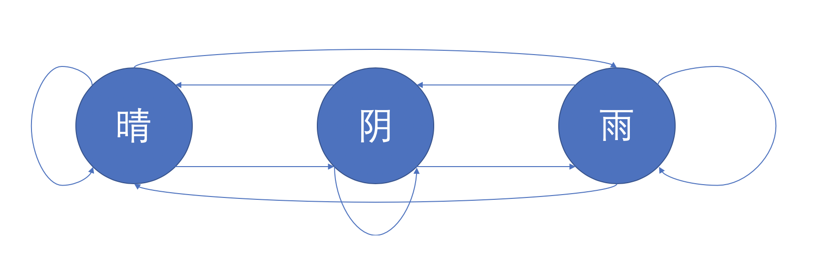
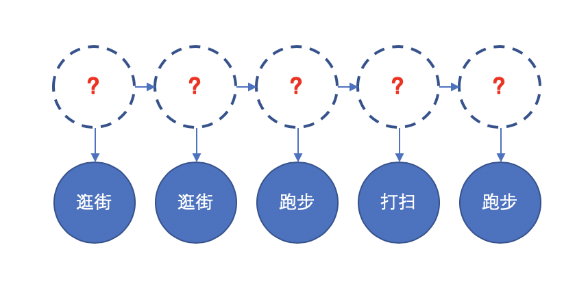

# HMM 知识点

## 1. 马尔可夫网络、马尔可夫模型、马尔可夫过程、贝叶斯网络的区别

1. 将随机变量作为结点，若两个随机变量相关或者不独立，则将二者连接一条边；若给定若干随机变量，则形成一个有向图，即构成一个 **网络** 。
2. 如果该网络是有向无环图，则这个网络称为 **贝叶斯网络。**
3. 如果这个图退化成线性链的方式，则得到 **马尔可夫模型** ；因为每个结点都是随机变量，将其看成各个时刻(或空间)的相关变化，以随机过程的视角，则可以看成是 **马尔可夫过程** 。
4. 若上述网络是无向的，则是无向图模型，又称 **马尔可夫随机场或者马尔可夫网络** 。
5. 如果在给定某些条件的前提下，研究这个马尔可夫随机场，则得到 **条件随机场** 。
6. 如果使用条件随机场解决标注问题，并且进一步将条件随机场中的网络拓扑变成线性的，则得到 **线性链条件随机场** 。

-- 摘自： http://blog.itpub.net/69942346/viewspace-2652334/

## 2. 马尔可夫模型

​	马尔可夫过程（Markov process）是一类随机过程。它的原始模型马尔可夫链，由俄国数学家A.A.马尔可夫于1907年提出。该过程具有如下特性：在已知目前状态（现在）的条件下，它未来的演变（将来）不依赖于它以往的演变 (过去 )。

​	每个状态的转移只依赖于之前的n个状态，这个过程被称为1个n阶的模型，其中n是影响转移状态的数目。最简单的马尔可夫过程就是一阶过程， **每一个状态的转移只依赖于其之前的那一个状态** ，这个也叫作 **马尔可夫性质** 。假设这个模型的每个状态都只依赖于之前的状态，这个假设被称为 **马尔科夫假设**。显然，这个假设可能是一个非常糟糕的假设，导致很多重要的信息都丢失了。用数学表达式表示就是下面的样子：
$$
P(X_{n+1}|X_1=x_1,X_2=x_2,\cdots,X_n=x_n)=P(X_{n+1}=x|X_n=x_n)
$$

状态转移矩阵如下（表中的数据是随机设置的）：

|      |  晴  |  阴  |  雨  |
| :--: | :--: | :--: | :--: |
|  晴  | 0.8  | 0.1  | 0.1  |
|  阴  | 0.4  | 0.1  | 0.5  |
|  雨  | 0.6  | 0.1  | 0.3  |

因此马尔可夫过程定了一下三个部分：

1. 状态：晴天、阴天和雨天
2. 初始向量：定义系统在时间为0的时候的状态的概率；
3. 状态转移矩阵：每种状态转换的概率，**这个就是马尔可夫模型根据训练数据训练出来的参数**。

​	马尔可夫模型（Markov Model）是一种统计模型，广泛应用在语音识别，词性自动标注，音字转换，概率文法等各个自然语言处理等应用领域。经过长期发展，尤其是在语音识别中的成功应用，使它成为一种通用的统计工具。到目前为止，它一直被认为是实现快速精确的语音识别系统的最成功的方法。

## 3. 隐马尔可夫模型

​	在某些情况下，马尔可夫不足以描述我们希望发现的模式。隐马尔可夫模型就是在马尔可夫模型的基础上加了一层

​	隐马尔可夫模型的三大问题：

1. 给定模型，如何有效计算产生观测序列的概率？换言之，如何评估模型与观测序列之间的匹配程度？
2. 给定模型和观测序列，如何找到与此观测序列最匹配的状态序列？换言之，如何根据观测序列推断出隐藏的模型状态？
3. 给定观测序列，如何调整模型参数使得该序列出现的概率最大？换言之，如何训练模型使其能最好地描述观测数据？

​	假设小明中秋节由三天假期，而在这三天假期中有三种活动：逛街、跑步和打扫卫生，但是这三种活动是受当天的天气的影响，那么我们希望找到一个模型，可以通过小明这三天的活动形式，来推断出下面活动序列所对应的天气状态。

根据隐马尔可夫模型的三大问题，在这个问题中我们提出对应的三个问题：

1. 已知整个模型，我观测到连续三天做的事情是：跑步，逛街，打扫。那么，根据模型，计算产生这些行为的概率是多少。
2. 同样知晓这个模型，同样是这三件事，我想猜，这三天的天气是怎么样的。
3. 最复杂的，我只知道这三天做了这三件事儿，而其他什么信息都没有。我得建立一个模型，晴雨转换概率，第一天天气情况的概率分布，根据天气情况选择做某事的概率分布。

​	隐马尔可夫模型其实就是概率模型，根据可观测的序列数据以及隐藏的状态，训练两个参数：隐藏状态转换概率矩阵和隐藏状态输出可观测状态的概率矩阵，使得可观测的序列数据出现的概率最大。

应用场景：

​	隐马尔可夫模型 (Hidden Markov Model) 是一种统计模型，一种概率图模型，用来描述一个含有隐含未知参数的马尔可夫过程。 **它是结构最简单的动态贝叶斯网，这是一种著名的有向图模型** ，主要用于时序数据建模，在语音识别、自然语言处理等领域有广泛应用，如下：词性标注、中文分词和命名实体识别等。

## 4. 采用EM算法解三个硬币问题

关于EM算法的解释可以参考这篇文章：[如何通俗理解EM算法](https://blog.csdn.net/v_july_v/article/details/81708386)

​	三个硬币问题就是上面小明问题的简化版。假设有三个硬币分别为A、B和C，其中正面为 H，反面为 T；抛掷规则如下：

1. 先抛掷 A，得出结果；
2. 如果硬币 A 的结果为 H（正面），则抛掷硬币 B，并记录硬币 B 的抛掷结果；
3. 如果硬币 A 的结果为 T（反面），则抛掷硬币 C，并记录硬币 C 的抛掷结果。

重复操作上面步骤后，会得出如下观测序列：

H T H H T T T H T H

抛掷单个硬币得到的正反面服从伯努利分布，设正面向上的概率为p，则写成概率公式如下：
$$
P(x)=p^x(1-p)^{1-x}
$$
单个硬币问题可以很简单通过极大似然估计计算出参数得出概念模型，但是在三个硬币的抛掷问题上，我们并不知道上述观测的每个结果是由硬币 B 还是硬币 C 所抛掷得出的结果。下面我们通过EM算法解三个硬币问题：

1. 假设硬币 A 的正面向上的概率为 $$\pi$$ ，初始值设为$$ \frac{6}{10} $$；硬币 B 的正面向上的概率为 $$p$$ ，初始值设为$$ \frac{5}{6} $$；硬币 c 的正面向上的概率为 $$q$$ ，初始值设为 $$ \frac{1}{4}$$ ；

2. 根据给定观测数据和当前的参数θ，求未观测数据 z 的条件概率分布的期望；
   $$
   似然函数：L(\theta) = argmax(P(x|\theta)) \\
   P(x|\theta) = \sum_{z}(P(x,z|\theta)) =\sum_{z}P(x|z,\theta)P(z|\theta)
   $$
   上述的 $$P(x|\theta)$$ 引入了隐藏变量 z，其中z 取值为 $$z=\{0, 1\}$$，其中 $$ z=1 $$ 表示该结果由硬币B抛掷所得，$$ z = 0 $$ 表示该结果由硬币C抛掷所得，故上述公式变化为：
   $$
   P(x|\theta) = \sum_{z}P(x|z,\theta)P(z|\theta) \\
   =P(x|z=1,\theta)P(z=1|\theta) + P(x|z=0,\theta)+P(z=0|\theta) \\
   其中：x\in\{0, 1\}\\
   P(x|z=1,\theta) = p^x(1-p)^{1-x}\\
   P(x|z=0.\theta) = q^x(1-q)^{1-x}\\
   P(z=1|\theta) = \pi \\
   P(z=0|\theta) = 1- \pi \\
   故：\\
   P(x|\theta) = \pi p^x(1-p)^{1-x} + (1-\pi)q^x(1-q)^{1-x}
   $$
   接着我们使用 $$ u_i $$ 来表示某个抛掷结果由硬币 B 抛掷所得的概率，通过 $$ \theta = (\pi,p,q)$$来表示：
   $$
   u_i = \frac{\pi p^{x_i}(1-p)^{1-x_i}}{\pi p^{x_i}(1-p)^{1-x_i} + (1-\pi)q^{x_i}(1-q)^{1-x_i}}
   $$
   上述公式中$$x_i$$表示某个抛掷结果，$$x_i=1$$表示正面，$$x_i=0$$表示反面。

3. 根据 z 的期望，重新计算参数 $$ \theta = (\pi,p,q) $$  ，根据上面的结果，我们已经得到每个结果关于由硬币B还是硬币C抛掷所得的概念分布，那么就可以计算出参数的值，下面的 N 表示序列结果的个数；
   $$
   \pi = \frac{\sum_{i=1}^{N}u_i}{N} \\
   p = \frac{\sum_{i=1}^{N}u_ix_i}{\sum_{i=1}^{N}u_i} \\
   q = \frac{\sum_{i=1}^{N}(1-u_i)x_i}{\sum_{i=1}^{N}(1-u_i)}
   $$
   对上面的公式解释如下：

   1. $$ \pi $$ 表示的是结果由硬币 B 抛掷所得的结果，即硬币 A 的抛掷得出正面结果的概率；而 $$u_i$$ 表示的正是第 i  个结果由硬币 B 抛掷所得的概率；
   2. $$ p $$ 表示的是结果由硬币 B 抛掷所得且结果为正面的概念，故分子表示的是在由硬币 B 抛掷所得的结果中取正面向上这部分；
   3. $$ q $$ 表示的是结果由硬币 C 抛掷所得且结果为正面的概念，而第 i 个结果由硬币 C 抛掷所得的概率为$$1-u_i$$，故分子表示的是在由硬币 C 抛掷所得的结果中取正面向上这部分；

4. 第二步对应EM算法中的 E 步，第三步对应 EM 算法中的 M 步；重复计算第2步和第3步，直到 $$\theta$$ 收敛；