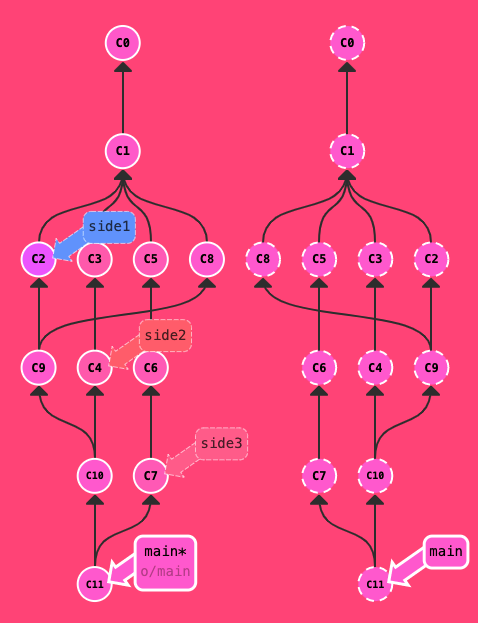
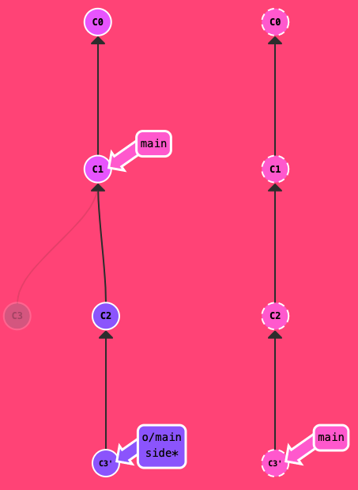
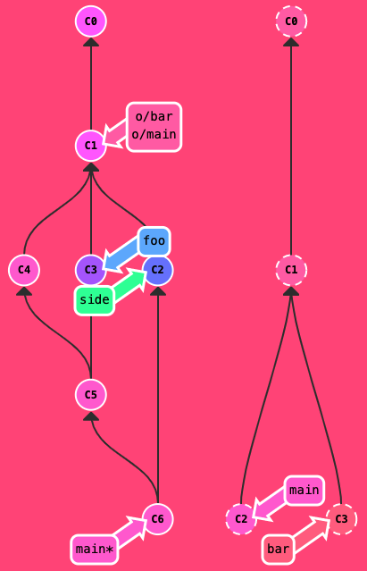

## 1. 常规命令

1. git commit

   作用：将更改的内容提交到所在分支

   参数：-m “comment” 变更内容的简短描述

2. git branch

   作用：查看和创建分支

   `git branch -a `：查看分支

   `git branch bugFix` ：创建一个 bugFix分支

3. git checkout

   作用：切换分支，加上参数 -b ，可以实现切换远程分支并创建一个本地对应的分支

   `git checkout` 切换分支

4. 合并分支：git merge

   作用：将分支合并到当前分支中，在 Git 中合并两个分支时会产生一个特殊的提交记录，它有两个父节点。翻译成自然语言相当于：“我要把这两个父节点本身及它们所有的祖先都包含进来。”

   `git merge bugFix `: 将 bugFix 分支合并到当前分支

5. 合并分支：git rebase

   作用：Rebase 实际上就是取出一系列的提交记录，“复制”它们，然后在另外一个地方逐个的放下去。移动以后会使得两个分支的功能看起来像是按顺序开发，但实际上它们是并行开发的。

   main 和 bugFix 两个分支并行开发，并各有一个commit，在 bugFix 分支上，执行 `git rebase main`，会将 bugFix 分支上的commit在 main 分支的基础进行依次提交，形成一个线性的提交序列。当然原来bugFix分支上的提交节点还在。

   然后切换到main分支上[`git checkout main`]，再执行 `git rebase bugFix `命令，不会执行操作，仅会同步main 分支引用到 bugFix分支引用上。

6. 分离 HEAD

   HEAD 是一个对当前检出记录的符号引用 —— 也就是指向你正在其基础上进行工作的提交记录。HEAD 总是指向当前分支上最近一次提交记录。

   分离的 HEAD 就是让其指向了某个具体的提交记录而不是分支名。通过哈希值指定提交记录。

   如main分支中最近一次提交记录为c1，执行 `git checkout c1 `后，HEAD 指向 c1 ，而不是main，则为分离 HEAD

7. 相对应用 ^

   使用 ^ 向上移动一个提交记录，也可以两个 ^^ 代表向上移动两个提交记录

   如 `git checkout main^` : 在main分支向上移动一个提交记录

   也可以先分离出 HEAD，再执行向上移动提交记录：git checkout c4, git checkout HEAD^

8. 相对引用2 ~

   使用 ~ <num> 向上移动多个提交记录，如 ~3

   如 `git checkout HEAD~4 `: 一次性后退 4 步

   实际应用：强制修改分支位置

   相对引用最多的就是移动分支。可以直接使用 `-f` 选项让分支指向另一个提交。

   如：`git branch -f main HEAD~3 `：将 main 分支强制指向 HEAD 的第 3 级父提交。

9. 撤销变更

   `git reset` : 通过把分支记录回退几个提交记录来实现撤销改动。你可以将这想象成“改写历史”。`git reset` 向上移动分支，原来指向的提交记录就跟从来没有提交过一样。**仅针对本地分支**

   `git reset HEAD~1 `: 在当前分支撤销一个提交记录

   `git revert` ：为了撤销提交记录并分享给别人。执行 `git revert HEAD` 后，会在提交一个更改记录，而该记录则是用于撤销上个记录记录的。

10. 移动提交记录：git cherry-pick

   将一些提交复制到当前所在的位置（`HEAD`）下面的话， cherry-pick 是最直接的方式了。 

   如将 dev 分支中的 c2 和 c4 提交的内容复制到当前位置（HEAD）则可以通过 cherry-pick 命名实现：`git cherry-pick C2 C4` ,其中 C2 和 C4 对应提交的 hash 值

11. 移动提交记录：交互 rebase

    但是如果不记得具体的 hash 值，则可以通过交互式的 rebase 实现，即使用带参数 `--interactive` 的 rebase 命令, 简写为 `-i`，在命令后增加了这个选项, Git 会打开一个 UI 界面并列出将要被复制到目标分支的备选提交记录，它还会显示每个提交记录的哈希值和提交说明，提交说明有助于你理解这个提交进行了哪些更改。

    `git rebase -i HEAD~4` 在交互窗口对 当前所在位置往前推 4 个提交进行操作。

12. 只取一个提交记录

    1. 第一种实现方式：

       `git checkout main` : 切换到主分支

       `git cherry-pick C4` ：将需要保留到分支复制到主分支中

    2. 第二种实现方式：

       `git checkout bugFix` ：切换到需要保留提交记录所在的分支上

       `git rebase -i HEAD~3` ：通过 交互式 rebase 操作前面所执行的提交，随后将不要的提交删除，保留进行保留即可；

13. 提交的技巧1

    > 问题描述：
    >
    > 你之前在 `newImage` 分支上进行了一次提交，然后又基于它创建了 `caption` 分支，然后又提交了一次。此时你想对某个以前的提交记录进行一些小小的调整。比如设计师想修改一下 `newImage` 中图片的分辨率，尽管那个提交记录并不是最新的了。
    >
    > 
    >
    > 解决方案：
    >
    > 我们可以通过下面的方法来克服困难：
    >
    > - 先用 `git rebase -i` 将提交重新排序，然后把我们想要修改的提交记录挪到最前
    >
    > - 然后用 `git commit --amend` 来进行一些小修改
    >
    > - 接着再用 `git rebase -i` 来将他们调回原来的顺序
    >
    > - 最后我们把 main 移到修改的最前端（用你自己喜欢的方法），就大功告成啦！
    >
    >   备注：当然完成这个任务的方法不止上面提到的一种（我知道你在看 cherry-pick 啦），之后我们会多点关注这些技巧啦，但现在暂时只专注上面这种方法。 最后有必要说明一下目标状态中的那几个`'` —— 我们把这个提交移动了两次，每移动一次会产生一个 `'`；而 C2 上多出来的那个是我们在使用了 amend 参数提交时产生的，所以最终结果就是这样了。

    

14. 提交的技巧2

    不使用 rebase -i，采用 git cherry-pick 来解决问题：

    1. `git checkout main`: 切换到主分支
    2. `git cherry-pick C2` ：将需要修改的提交复制到当前分支的最前面
    3. `git commit --amend` ：提交修改
    4. `git cherry-pick C3` ：将原来后面的提交再移动到前面来

15. git tag

    Git 的 tag 可以（在某种程度上 —— 因为标签可以被删除后重新在另外一个位置创建同名的标签）永久地将某个特定的提交命名为里程碑，然后就可以像分支一样引用了。

    更难得的是，它们并不会随着新的提交而移动。你也不能检出到某个标签上面进行修改提交，它就像是提交树上的一个锚点，标识了某个特定的位置。

    `git tag v1 C2` : v1 为 tag 名称，C2 为指定的提交记录

16. git describe

    由于标签在代码库中起着“锚点”的作用，Git 还为此专门设计了一个命令用来**描述**离你最近的锚点（也就是标签），它就是 `git describe`！

    Git Describe 能帮你在提交历史中移动了多次以后找到方向；当你用 `git bisect`（一个查找产生 Bug 的提交记录的指令）找到某个提交记录时，或者是当你坐在你那刚刚度假回来的同事的电脑前时， 可能会用到这个命令。

    > `git describe` 的语法是：
    >
    > ```
    > git describe <ref>
    > ```
    >
    > `<ref>` 可以是任何能被 Git 识别成提交记录的引用，如果你没有指定的话，Git 会以你目前所检出的位置（`HEAD`）。
    >
    > 它输出的结果是这样的：
    >
    > ```
    > <tag>_<numCommits>_g<hash>
    > ```
    >
    > `tag` 表示的是离 `ref` 最近的标签， `numCommits` 是表示这个 `ref` 与 `tag` 相差有多少个提交记录， `hash` 表示的是你所给定的 `ref` 所表示的提交记录哈希值的前几位。
    >
    > 当 `ref` 提交记录上有某个标签时，则只输出标签名称

## 2. 远程仓库操作命令

1. git clone

   `git clone` 命令在真实的环境下的作用是在**本地**创建一个远程仓库的拷贝（比如从 github.com）。

2. 远程仓库

   指的是远程服务器上面的备份

   Git 远程仓库相当的操作实际可以归纳为两点：向远程仓库传输数据以及从远程仓库获取数据。既然我们能与远程仓库同步，那么就可以分享任何能被 Git 管理的更新（因此可以分享代码、文件、想法、情书等等）。

3. git fetch

   `git fetch` 完成了仅有的但是很重要的两步:

   - 从远程仓库下载本地仓库中缺失的提交记录
   - 更新远程分支指针(如 `origin/main`)

   `git fetch` 实际上将本地仓库中的远程分支更新成了远程仓库相应分支最新的状态。

   如果你还记得上一节课程中我们说过的，远程分支反映了远程仓库在你**最后一次与它通信时**的状态，`git fetch` 就是你与远程仓库通信的方式了！希望我说的够明白了，你已经了解 `git fetch` 与远程分支之间的关系了吧。

   **`git fetch` 并不会改变你本地仓库的状态。它不会更新你的 `main` 分支，也不会修改你磁盘上的文件。可以将 `git fetch` 的理解为单纯的下载操作。**

4. git pull

   git pull 实际等于 git fetch 和 git merge 两条命令的作用

   即先拉取远程仓库提交的记录到本地，然后再合并更新到对应分支上

5. git push

   将本地仓库提交的记录推送到远程仓库中对应的分支中

6. 偏离的提交历史

   > 假设你周一克隆了一个仓库，然后开始研发某个新功能。到周五时，你新功能开发测试完毕，可以发布了。但是 —— 天啊！你的同事这周写了一堆代码，还改了许多你的功能中使用的 API，这些变动会导致你新开发的功能变得不可用。但是他们已经将那些提交推送到远程仓库了，因此你的工作就变成了基于项目**旧版**的代码，与远程仓库最新的代码不匹配了。
   >
   > 这种情况下, `git push` 就不知道该如何操作了。如果你执行 `git push`，Git 应该让远程仓库回到星期一那天的状态吗？还是直接在新代码的基础上添加你的代码，亦或由于你的提交已经过时而直接忽略你的提交？
   >
   > 因为这情况（历史偏离）有许多的不确定性，Git 是不会允许你 `push` 变更的。实际上它会强制你先合并远程最新的代码，然后才能分享你的工作。

   1. 采用 rebase 的方案

      `git fetch` : 下载远程仓库的新的记录

      `git rebase o/main` : 将 o/main 分支上新的提交记录在当前分支下复制一份

      `git push` : 将当前分支上已经合并好的记录内容提交到远程仓库中

   2. 采用 merge 的方案

      `git fetch` : 下载远程仓库的新的记录

      `git merge o/main` : 将 o/main 分支上新的提交记录合并到当前分支

      `git push` : 将当前分支上已经合并好的记录内容提交到远程仓库中

   3. 简化命令

      git pull = git fetch & git merge

      git pull --rebase = git fetch & git rebase

      `git pull --rebase` : 下载远程仓库的新的记录，并将这些记录在当前分支下复制一份

      `git push` : 将当前分支上已经合并好的记录内容提交到远程仓库中

7. 锁定的Main (locked main)

   1. 为什么会被拒绝？

      远程服务器拒绝直接推送(push)提交到main, 因为策略配置要求 pull requests 来提交更新.

      你应该按照流程,新建一个分支, 推送(push)这个分支并申请pull request,但是你忘记并直接提交给了main.现在你卡住并且无法推送你的更新.

   2. 解决办法

      新建一个分支feature, 推送到远程服务器. 然后reset你的main分支和远程服务器保持一致, 否则下次你pull并且他人的提交和你冲突的时候就会有问题.

## 3. 高级命令

1. 多次 rebase

   初始状态：

   

   目标状态：

   

   解决方案命令：

   ```shell
   git rebase main bugFix
   git rebase bugFix side
   git rebase side another
   git rebase another main
   ```

   

2. 两个父节点

   操作符 `^` 与 `~` 符一样，后面也可以跟一个数字。

   但是该操作符后面的数字与 `~` 后面的不同，并不是用来指定向上返回几代，而是指定合并提交记录的某个父提交。还记得前面提到过的一个合并提交有两个父提交吧，所以遇到这样的节点时该选择哪条路径就不是很清晰了。

   git 默认选择合并提交的“第一个”父提交，在操作符 `^` 后跟一个数字可以改变这一默认行为。

   如 main 往上有两个父节点，则我们在执行 `git checkout main^`，默认或者只会检出第一个父节点，如果要选择第二个父节点则需要执行：`git checkout main^2` 

   那么使用 ~ 和 ^ 的组合则可以在提交树上自由移动。如 `git checkout HEAD~; git checkout HEAD^2; git checkout HEAD~2`

   这些符号支持链式操作，如 `git checkout HEAD~^2~2`

   > 问题：在指定提交记录上创建分支，使用相对引用
   >
   > 解决方案：`git branch bugWork main^^2^`

3. 纠缠不清的分支

   初始状态：

   

   目标状态：

   

   解决方案：

   ```sh
   git checkout one
   git cherry-pick C4 C3 C2
   git checkout two
   git cherry-pick C5 C4 C3 C2
   git branch -f three C2
   ```

   

4. 推送主分支

   1. 合并特性分支

      > 在大型项目中开发人员通常会在（从 `main` 上分出来的）特性分支上工作，工作完成后只做一次集成。这跟前面课程的描述很相像（把 side 分支推送到远程仓库），不过本节我们会深入一些.
      >
      > 但是有些开发人员只在 main 上做 push、pull —— 这样的话 main 总是最新的，始终与远程分支 (o/main) 保持一致。
      >
      > 对于接下来这个工作流，我们集成了两个步骤：
      >
      > - 将特性分支集成到 `main` 上
      > - 推送并更新远程分支

   2. 初始状态：

      

   3. 目标状态：

      

   4. 解决方案：

      ```shell
      git pull --rebase
      git rebase main side1
      git rebase side1 side2
      git rebase side2 side3
      git rebase side3 main
      git push
      ```

5. 合并远程仓库

   采用 merge 替代 rebase 解决上面的问题。

   1. 初始状态：

      

   2. 目标状态：

      

   3. 解决方案：

      ```shell
      git checkout main
      git merge side1
      git merge side2
      git merge side3
      git push
      ```

      

6. 远程追踪

   ​	直接了当地讲，`main` 和 `o/main` 的关联关系就是由分支的“remote tracking”属性决定的。`main` 被设定为跟踪 `o/main` —— 这意味着为 `main` 分支指定了推送的目的地以及拉取后合并的目标。

   ​	你可能想知道 `main` 分支上这个属性是怎么被设定的，你并没有用任何命令指定过这个属性呀！好吧, 当你克隆仓库的时候, Git 就自动帮你把这个属性设置好了。

   ​	当你克隆时, Git 会为远程仓库中的每个分支在本地仓库中创建一个远程分支（比如 `o/main`）。然后再创建一个跟踪远程仓库中活动分支的本地分支，默认情况下这个本地分支会被命名为 `main`。

   ​	克隆完成后，你会得到一个本地分支（如果没有这个本地分支的话，你的目录就是“空白”的），但是可以查看远程仓库中所有的分支（如果你好奇心很强的话）。这样做对于本地仓库和远程仓库来说，都是最佳选择。

   当然，我们也可以自己设定这个属性，有两种方式：

   1. `git checkout -b totallyNotMain o/main` : 通过远程分支检出一个新的分支，就可以创建一个名为 `totallyNotMain` 的分支，它跟踪远程分支 `o/main`。
   2. `git branch -u o/main foo` : 设置远程追踪分支的方法就是使用：`git branch -u` 命令，这样 `foo` 就会跟踪 `o/main` 了。如果当前就在 foo 分支上, 还可以省略 foo：`git branch -u o/main`

   初始状态：

   

   目标状态：

   

   解决方案：

   ```shell
   git checkout -b side o/main
   git commit
   git pull --rebase
   git push
   ```

   

7. git push 的参数1

   在远程跟踪课程中，你已经学到了 Git 是通过当前检出分支的属性来确定远程仓库以及要 push 的目的地的。这是未指定参数时的行为，我们可以为 push 指定参数，语法是：`git push <remote> <place>`

   `git push origin main` : 切到本地仓库中的“main”分支，获取所有的提交，再到远程仓库“origin”中找到“main”分支，将远程仓库中没有的提交记录都添加上去，搞定之后告诉我。

   我们通过“place”参数来告诉 Git 提交记录来自于 main, 要推送到远程仓库中的 main。它实际就是要同步的两个仓库的位置。

   初始状态：

   

   目标状态：

   

   解决方案：

   ```
   git push origin main
   git push origin foo
   ```

   

8. git push 的参数2

   > 要同时为源和目的地指定 `<place>` 的话，只需要用冒号 `:` 将二者连起来就可以了：
   >
   > ```
   > git push origin <source>:<destination>
   > ```
   >
   > 这个参数实际的值是个 refspec，“refspec” 是一个自造的词，意思是 Git 能识别的位置（比如分支 `foo` 或者 `HEAD~1`）
   >
   > 如：`git push origin foo^:main`
   >
   > 如果推送的目的分支不存在的话，Git 会在远程仓库中根据你提供的名称帮你创建这个分支！
   >
   > 如：`git push origin main:newBranch`

   初始状态：

   

   目标状态：

   

   解决方案：

   ```
   git push origin foo:main
   git push origin C5:foo
   ```

   

9. git fetch 的参数

   git fetch 也跟 git push 一样有上述那些参数。

   如：`git fetch origin foo` : Git 会到远程仓库的 `foo` 分支上，然后获取所有本地不存在的提交，放到本地的 `o/foo` 上。

   如：`git fetch origin foo~1:bar` : Git 将 `foo~1` 解析成一个 origin 仓库的位置，然后将那些提交记录下载到了本地的 `bar` 分支（一个本地分支）上。注意由于我们指定了目标分支，`foo` 和 `o/foo` 都没有被更新。

   备注：跟 git push 一样，Git 会在 fetch 前自己创建立本地分支, 就像是 Git 在 push 时，如果远程仓库中不存在目标分支，会自己在建立一样。

   当然如果 git fetch 没有设定参数时，则是下载所有的提交记录到各个远程分支。

   初始状态：

   

   目标状态：

   

   解决方案：

   ```
   git fetch origin foo:main
   git fetch origin main~1:foo
   git checkout foo
   git merge main
   ```

   

10. 没有source的source

    Git 有两种关于 `<source>` 的用法是比较诡异的，即你可以在 git push 或 git fetch 时不指定任何 `source`，方法就是仅保留冒号和 destination 部分，source 部分留空。

    - `git push origin :side` :  删除远程仓库的 side 分支
    - `git fetch origin :bugFix` : 在本地仓库创建一个 bugFix 分支

11. git pull 的参数

    `git pull origin foo` 相当于：`git fetch origin foo; git merge o/foo`

    `git pull origin bar~1:bugFix` 相当于：`git fetch origin bar~1:bugFix; git merge bugFix`

    看到了? git pull 实际上就是 fetch + merge 的缩写, git pull 唯一关注的是提交最终合并到哪里（也就是为 git fetch 所提供的 destination 参数）

    `git pull origin main` : 通过指定 `main` 我们更新了 `o/main`。然后将 `o/main` merge 到我们的检出位置，**无论**我们当前检出的位置是哪。

    `git pull origin main:foo` : 当前在 bar 分支上。它先在本地创建了一个叫 `foo` 的分支，从远程仓库中的 main 分支中下载提交记录，并合并到 `foo`，然后再 merge 到我们的当前检出的分支 `bar` 上。

    初始状态：

    

    目标状态：

    

    解决方案：

    ```shell
    git pull origin bar:foo
    git pull origin main:side
    ```

    

